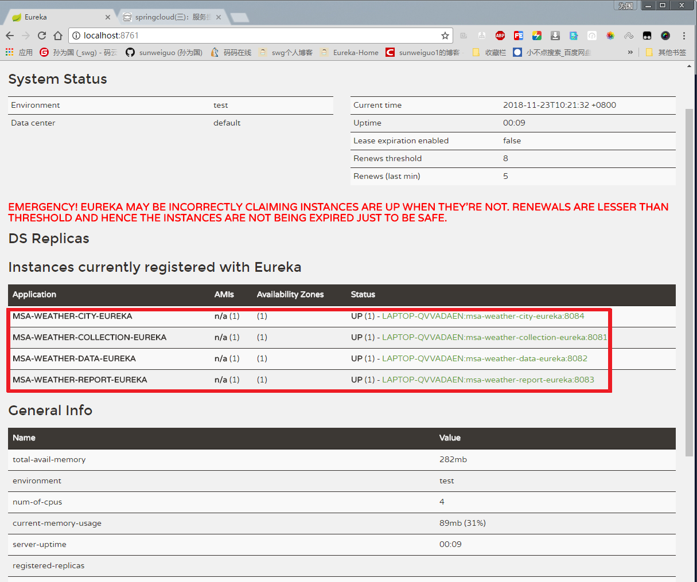

# 7.天气预报系统-微服务的注册和发现

## 1.什么是spring cloud

`Spring Cloud`是一系列框架的有序集合。它利用`Spring Boot`的开发便利性巧妙地简化了分布式系统基础设施的开发，如服务发现注册、配置中心、消息总线、负载均衡、断路器、数据监控等，都可以用`Spring Boot`的开发风格做到一键启动和部署。Spring并没有重复制造轮子，它只是将目前各家公司开发的比较成熟、经得起实际考验的服务框架组合起来，通过`Spring Boot`风格进行再封装屏蔽掉了复杂的配置和实现原理，最终给开发者留出了一套简单易懂、易部署和易维护的分布式系统开发工具包。

微服务是可以独立部署、水平扩展、独立访问（或者有独立的数据库）的服务单元，`spring cloud`就是这些微服务的大管家，采用了微服务这种架构之后，项目的数量会非常多，`spring cloud`做为大管家需要管理好这些微服务，自然需要很多小弟来帮忙。

解决了分布式系统中的一些问题:配置管理、服务注册、服务发现、断路器、智能路由、负载均衡、服务间调用、一次性令牌、全局锁、领导选举、控制总线、思维导图、分布式会话、集群状态、分布式消息。。。

## 2.spring cloud & spring boot

- SpringBoot是构建spring cloud架构的基石

## 3.spring cloud子项目

参考这篇文章：[springcloud(一)：大话Spring Cloud](http://www.ityouknow.com/springcloud/2017/05/01/simple-springcloud.html)


## 4.Eureka

#### 4.1.服务中心

服务中心又称注册中心，管理各种服务功能包括服务的注册、发现、熔断、负载、降级等，比如`dubbo admin`后台的各种功能。

有了服务中心调用关系会有什么变化，画几个简图来帮忙理解.

项目A调用项目B


```
graph LR
项目A-->项目B
```
有了服务中心之后，任何一个服务都不能直接去掉用，都需要通过服务中心来调用

```
graph LR
项目A-->注册中心再去访问项目B
```
由于各种服务都注册到了服务中心，就有了去做很多高级功能条件。比如几台服务提供相同服务来做均衡负载；监控服务器调用成功率来做熔断，移除服务列表中的故障点；监控服务调用时间来对不同的服务器设置不同的权重等等。


#### 4.2.Eureka

- `Spring Cloud` 封装了 `Netflix` 公司开发的 `Eureka` 模块来实现服务注册和发现。
-  `Eureka Server` 作为服务注册功能的服务器，它是服务注册中心。而系统中的其他微服务，使用 `Eureka` 的客户端连接到 `Eureka Server`，并维持心跳连接。
-  这样系统的维护人员就可以通过 `Eureka Server` 来监控系统中各个微服务是否正常运行。
-  `Spring Cloud` 的一些其他模块（比如`Zuul`）就可以通过 `Eureka Server` 来发现系统中的其他微服务，并执行相关的逻辑。
- Eureka由两个组件组成：Eureka服务器和Eureka客户端。Eureka服务器用作服务注册服务器。Eureka客户端是一个java客户端，用来简化与服务器的交互、作为轮询负载均衡器，并提供服务的故障切换支持。


其中有三个角色：

- `Eureka Server`：提供服务注册和发现
- `Service Provider`服务提供方，将自身服务注册到`Eureka`，从而使服务消费方能够找到
- `Service Consumer`：服务消费方，从`Eureka`获取注册服务列表，从而能够消费服务


#### 4.3.Eureka Server

新建一个springboot项目。spring cloud已经帮我实现了服务注册中心，我们只需要很简单的几个步骤就可以完成。

演示的springboot版本是最新的`<version>2.1.0.RELEASE</version>`,springcloud也是最新的`<version>Finchley.RELEASE</version>`

1、pom中添加依赖


```xml
<dependencyManagement>
    <dependencies>
        <dependency>
            <groupId>org.springframework.cloud</groupId>
            <artifactId>spring-cloud-dependencies</artifactId>
            <version>Finchley.RELEASE</version>
            <type>pom</type>
            <scope>import</scope>
        </dependency>
    </dependencies>
</dependencyManagement>

<dependencies>
    <dependency>
        <groupId>org.springframework.boot</groupId>
        <artifactId>spring-boot-starter-web</artifactId>
    </dependency>

    <dependency>
        <groupId>org.springframework.boot</groupId>
        <artifactId>spring-boot-starter-test</artifactId>
        <scope>test</scope>
    </dependency>

    <!--Eureka server-->
    <dependency>
        <groupId>org.springframework.cloud</groupId>
        <artifactId>spring-cloud-starter-netflix-eureka-server</artifactId>
    </dependency>
    
</dependencies>
```


2、添加启动代码中添加@EnableEurekaServer注解


```java
@SpringBootApplication
@EnableEurekaServer
public class WeatherEurekaServerApplication {

    public static void main(String[] args) {
        SpringApplication.run(WeatherEurekaServerApplication.class, args);
    }
}
```

3、配置文件

在默认设置下，该服务注册中心也会将自己作为客户端来尝试注册它自己，所以我们需要禁用它的客户端注册行为，在application.yml：


```
server:
  port: 8761
eureka:
  instance:
    hostname: localhost
  client:
    register-with-eureka: false
    fetch-registry: false
    service-url:
      defaultZone: http://${eureka.instance.hostname}:${server.port}/eureka/
```

- `eureka.client.register-with-eureka` ：表示是否将自己注册到Eureka Server，默认为true。
- `eureka.client.fetch-registry` ：表示是否从Eureka Server获取注册信息，默认为true。
- `eureka.client.serviceUrl.defaultZone` ：设置与Eureka Server交互的地址，查询服务和注册服务都需要依赖这个地址。默认是http://localhost:8761/eureka ；多个地址可使用 , 分隔。
- 
启动工程后，访问：http://localhost:8761/ ，可以看到下面的页面，其中还没有发现任何服务


关于集群，参考这篇文章：http://www.ityouknow.com/springcloud/2017/05/10/springcloud-eureka.html

#### 4.4.Eureka Client

基本与上一个是类似的。

主要的配置文件：


```
spring:
  application:
    name: weather-eureka-client
eureka:
  client:
    service-url:
      defaultZone: http://localhost:8761/eureka
```

这样同时启动`Eureka Server`和`Eureka Client`两个工程。在网站中输入`localhost://8761`就可以看到注册到`Eureka Server`的实例了。

## 5.本门实战

将之前的四个微服务改造为eureka的客户端。

即将

`mas-weather-collection-server`

`mas-weather-report-server`

`mas-weather-data-server`

`mas-weather-city-server`

改为：

`mas-weather-collection-eureka`

`mas-weather-report-eureka`

`mas-weather-data-eureka`

`mas-weather-city-eureka`

改造过程十分简单，就是引入依赖，修改配置即可。

同时启动这四个微服务客户端和一个eureka服务端。

我们可以看到：



电脑要爆炸了~~~~~~

下面，这些微服务之间可以相互访问了。


