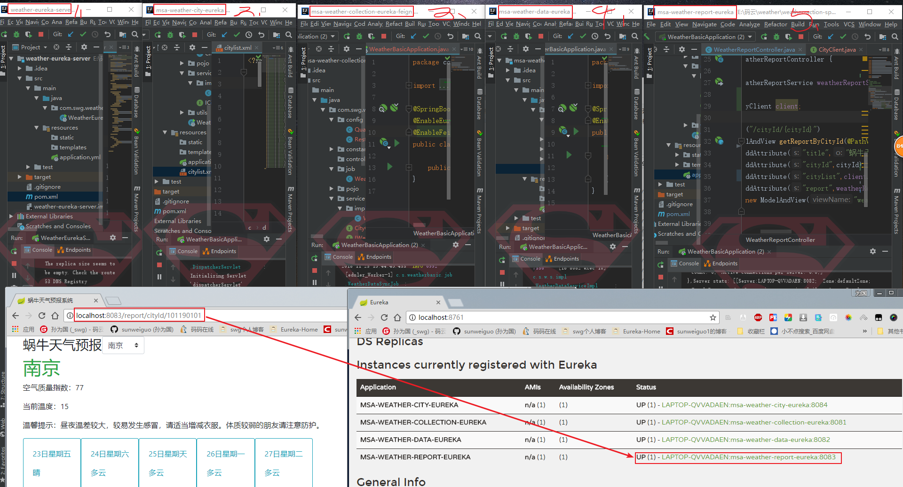

# <font color="#337ab7">8.天气预报系统-微服务的消费</font>

## <font color="#73BF00">#</font> <font color="#337ab7">1.发现模式</font>

直连模式：

直接去连接某个url，比较简单粗暴，但是不能实现负载均衡和高可用，使用比较少。

客户端发现模式：

- 服务实例启动后，将自己的位置信息提交到服务注册表
- 客户端从服务注册表进行查询，来获取可用的服务实例
- 客户端自行使用负载均衡算法从多个服务实例中选择一个


服务端发现模式：

负载均衡的实现在服务端。而客户端发现模式的负载均衡由客户端来实现。


## <font color="#73BF00">#</font> <font color="#337ab7">1.服务的消费者</font>

`Apache HttpClient`：这个比较简单，不再赘述。

`Ribbon`: 基于客户端负载均衡工具。可以基于Http或者Tcp实现负载均衡。

直接根据服务的名字来消费，具体是连到哪一个具体的ip去消费是不用管的，因为他已经在客户端上做了一定的负载均衡算法，由他的算法来决定。

`Febin`:


Feign是一个声明式的伪Http客户端，它使得写Http客户端变得更简单。使用Feign，只需要创建一个接口并注解。它具有可插拔的注解特性，可使用Feign 注解和JAX-RS注解。Feign支持可插拔的编码器和解码器。Feign默认集成了Ribbon，并和Eureka结合，默认实现了负载均衡的效果。

我们先来搞个demo测试一把！

## <font color="#73BF00">#</font> <font color="#337ab7">3.Demo for Feign</font>

首先，我们之前的工作中已经由了一个`Eureka server`，再拿一个叫做`msa-weather-city-server`的服务来测试。这个服务的主要功能是获取城市信息。

#### <font color="#337ab7">##</font> 3.1 引入依赖、添加注解

首先引入feign依赖，注意这里有个坑，我一开始没有指定版本号，死活无法导入`@EnableFeignClients`这个注解：


```xml
<dependency>
    <groupId>org.springframework.cloud</groupId>
    <artifactId>spring-cloud-starter-openfeign</artifactId>
    <version>2.0.1.RELEASE</version>
</dependency>
```
在程序的启动类ServiceFeignApplication ，加上@EnableFeignClients注解开启Feign的功能：


```java
@SpringBootApplication
@EnableDiscoveryClient
@EnableFeignClients
public class EurekaClientFeignApplication {

    public static void main(String[] args) {
        SpringApplication.run(EurekaClientFeignApplication.class, args);
    }
}
```
#### <font color="#337ab7">##</font> 3.2 配置文件


```
spring:
  application:
    name: eureka-weather-feign
eureka:
  client:
    service-url:
      defaultZone: http://localhost:8761/eureka

feign:
  client:
    config:
      feignName:
        connectTimeout: 5000
        readTimeout: 5000
```


#### <font color="#337ab7">##</font> 3.3 定义feign接口

定义一个feign接口，通过@ FeignClient（“服务名”），来指定调用哪个服务。比如在代码中调用了`msa-weather-city-eureka`服务的“/cities”接口来获取所有的城市列表，代码如下：


```java
@FeignClient("msa-weather-city-eureka")
public interface CityClient {
    @GetMapping("/cities")
    String listCity();
}
```

#### <font color="#337ab7">##</font> 3.4 定义API来供浏览器调用


```java
@RestController
public class TestController {
    @Autowired
    private CityClient cityClient;
    @GetMapping("cities")
    public String getData(){
        String res = cityClient.listCity();
        return res;
    }
}
```
这样，启动服务中心`Eureka server`和服务提供方`msa-weather-city-server`以及本消费服务。再浏览器中访问对应的url：http://localhost:8080/cities就可以调用到`msa-weather-city-server`提供的服务。

至此，demo演示完毕。


## <font color="#73BF00">#</font> <font color="#337ab7">4.用Feign继续完善天气项目</font>


有三个`TODO`项：

- 数据采集微服务在天气数据同步任务中，依赖于城市数据API微服务
- 天气预报微服务查询天气信息，依赖于天气数据API微服务
- 天气预报微服务提供的城市列表，依赖于城市数据API微服务

那么我们可以看出来，需要去集成Feign去消费的微服务只有两个：`msa-weather-collection-eureka`和`msa-weather-report-eureka`。我们将其改造为：`msa-weather-collection-eureka-feign`和`msa-weather-report-eureka-feign`.

这里就以`msa-weather-collection-eureka`为例，步骤基本与demo一样。首先是引入依赖，然后加上注解开启Feign功能。新建一个接口，还是获取城市列表。我只要指定好那个城市列表的微服务的名字和路径，就可以获取到了。不清楚直接看代码即可。

<font color="red">那么在全部改好之后，我们启动这五个项目。但是我们要注意，先启动`weather-eureka-server`，来提供注册的服务。然后启动城市数据服务，因为天气数据采集要用到他。然后启动天气数据采集服务。然后一次启动天气数据API服务和天气预报UI显示服务。</font>

那么我们访问天气预报UI对应的URL,以南京为例：`http://localhost:8083/report/cityId/101190101`，如果功能是正常的，标识微服务改造初步成功。

